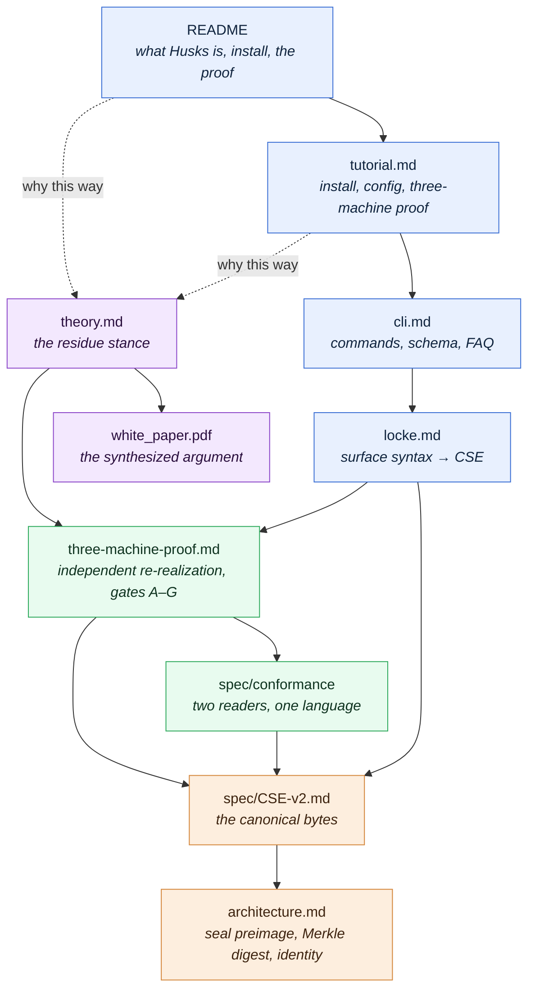

# Husks Documentation

> **Build Husks, not vibes.** This index is a reading **DAG**, not a flat list.

There are two ways through these docs.

**Top-down, by need.** Start at the surface and stop when your question is
answered. Most people never need to go below the first stratum.

**Deep, by register.** Read the whole descent. The further down you go, the
more the register shifts: from *how you use it*, to the *philosophy* it rests
on, to the *science* that makes it trustworthy, to the *formal math* that
defines what it actually is. Each stratum is a prerequisite for the one below
it, never the reverse.

The descent mirrors the codebase's own layer structure in reverse: you enter at
the **L7** user surface (`cli`) and descend toward the **L0** kernel, where the
wire format and the seal algebra live. The code's dependency arrows point *down*
toward the kernel; a reader's attention travels the same spine in the same
direction. (The machine-checkable version of that spine is
[`../layers.toml`](../layers.toml).)

---

## The reading DAG

Solid arrows are *read-before* prerequisites. Dashed arrows are *go-deeper*
pointers you can defer. The four colors are the four registers, top to bottom:
**surface → philosophy → science → formal**.

---

## Stratum 1: Surface · *use it* · L7 (`cli`), L5 (`locke`)

The public face. Friendly, task-oriented, no theory required.

| Document | Answers | Read after |
| :-- | :-- | :-- |
| [`../README.md`](../README.md) | What is Husks? How do I install it and run the proof? | (start here) |
| [tutorial.md](tutorial.md) | How do I install, configure, and run the three-machine proof? | README |
| [cli.md](cli.md) | What does each command do? What's the JSON/Locke schema? | tutorial |
| [locke.md](locke.md) | What is the Locke design language and why does it look like that? | cli |

If all you want is to build something, you can stop here.

## Stratum 2: Philosophy · *why it's built this way* · the posture beneath every layer

Husks rests on one methodological choice: treat a model call as an opaque
event and verify only its **residue**, the bytes left on disk. This stratum is
the *why*. It is upstream of everything technical.

| Document | Answers | Read after |
| :-- | :-- | :-- |
| [theory.md](theory.md) | Why verify residue instead of grading the event? Why not an agent loop? | the surface (or read first, if you came for the idea) |
| [white_paper.pdf](white_paper.pdf) | The full synthesized argument. | theory.md |

## Stratum 3: Science · *why you can trust it* · L3 (`engine`), L0 gate

A claim is only worth as much as its falsifiability. This stratum is the
empirical core: the same design, realized independently, must produce
verifiably equivalent residue, and two independent readers must accept exactly
the same language.

| Document | Answers | Read after |
| :-- | :-- | :-- |
| [three-machine-proof.md](three-machine-proof.md) | What must hold for a build to be independently verifiable? What do gates A–G verify? | theory.md |
| [spec/conformance/](../spec/conformance/) | How do we prove the Python reader and the JS reader agree? | three-machine-proof |

## Stratum 4: Formal / Math · *what it actually is* · L1–L0 (`kernel`)

The bottom. Here the system is defined, not described: a canonical byte
encoding, a seal preimage, a Merkle node digest, and the recipe-identity
algebra that makes two builds provably the same.

| Document | Answers | Read after |
| :-- | :-- | :-- |
| [spec/CSE-v2.md](../spec/CSE-v2.md) | What are the canonical bytes? (Current wire version.) | the science stratum |
| [spec/CSE-v1.md](../spec/CSE-v1.md) | The frozen prior wire version, kept for vector stability. | CSE-v2 |
| [architecture.md](architecture.md) | Seal preimage, node digest (Merkle DAG), recipe identity, the execution calculus. | CSE-v2 |
| [`../layers.toml`](../layers.toml) | The machine-checkable layer contract (`husks doctor --arch`). | architecture.md |

## Off the spine: Contributor / process

Not part of the conceptual descent; consult as needed.

| Document | Contents |
| :-- | :-- |
| [TESTS.md](TESTS.md) | Test-suite map: the eight layer suites (L0 kernel through L7 cli), the three-machine spine, and how to run each. |
